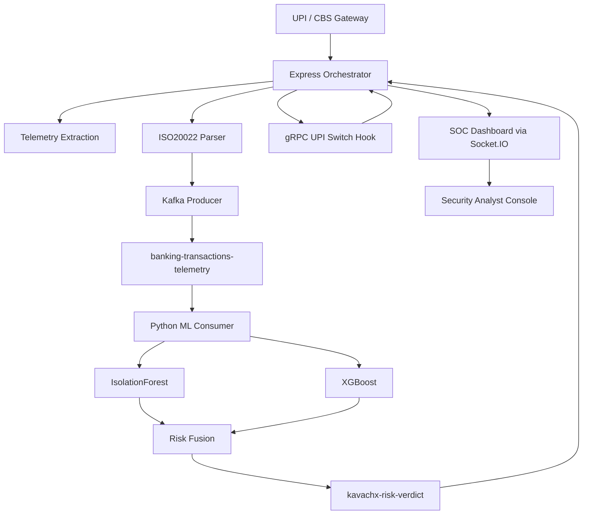

# KavachX Enterprise Financial Cybersecurity Platform

A hackathon-winning, enterprise-grade MERN architecture for banking cybersecurity automation, designed to protect CBS gateways and UPI switch traffic with AI-driven risk analytics.

---

## 🚀 Executive Summary

KavachX is a modular security platform that decouples:

- **Transaction orchestration** in Node.js/Express
- **Real-time risk fusion** in Python ML
- **SOC observability** in React/Vite

This repository delivers a production-ready skeleton optimized for high throughput, sub-millisecond decisioning, and secure integration with banking and payments infrastructure.

---

## 🌐 Project Structure

```text
kavachx-orchestrator-backend/
  └── src/
      ├── config/kafka.js
      ├── controllers/transaction.controller.js
      ├── controllers/auth.controller.js
      ├── middleware/riskEngine.js
      └── server.js

kavachx-ml-core/
  ├── app.py
  └── workers/kafka_consumer.py

kavachx-admin-dashboard/
  └── src/pages/LiveThreats.jsx
```

---

## 🧠 Core Capabilities

### 1. Middleware telemetry capture

- Extracts explicit login metadata.
- Validates invisible browser telemetry:
  - Canvas fingerprint
  - WebGL extensions
  - JA3 TLS fingerprint
  - DOM anomaly score

### 2. ISO 20022 transaction validation

- Parses `pacs.008` XML credit transfer messages.
- Validates amount, currency, and customer identifiers.
- Emits canonical JSON events into Kafka topic `banking-transactions-telemetry`.

### 3. Risk gating and mitigation

- Pauses transaction finalization until a verdict arrives.
- Communicates through:
  - Low-latency gRPC hook to the UPI switch
  - Asynchronous Kafka verdict topic `kavachx-risk-verdict`
- Triggers automated mitigation when `riskScore >= 0.75`:
  - freeze session
  - invalidate JWT
  - notify SOC via WebSockets

### 4. Ensemble scoring architecture

The ML consumer implements a dual-model evaluation pipeline:

- `IsolationForest` for behavioral anomaly profiling
- `XGBoost` for financial fraud risk scoring

Global risk index formula:

```text
R_Global = w_1 * (1 - s_if) + w_2 * s_xgb
w_1 = 0.40, w_2 = 0.60
```

Where:

- `s_if` = anomaly sample score from Isolation Forest
- `s_xgb` = fraud probability from XGBoost

A decision rule then applies:

```text
decision = block if R_Global >= 0.75 else allow
```

---

## 📈 Risk Metrics and Decision Logic

| Metric | Purpose | Threshold |
|---|---|---|
| `riskScore` | Unified fraud probability | `>= 0.75` blocks transaction |
| `domAnomalyScore` | Browser DOM tampering indicator | `0.0 - 1.0` |
| `transactionToken` | End-to-end traceability | UUID per transaction |


### Sample request payload

```http
POST /api/transactions HTTP/1.1
Content-Type: application/xml
x-user-id: user-123
x-session-id: session-abc
x-canvas-fingerprint: <hash>
x-webgl-extensions: WEBGL_depth_texture,...
x-ja3-fingerprint: 771,4865-4866-... x-dom-anomaly-score: 0.92

<Envelope>
  <Document>
    <FIToFICstmrCdtTrf>
      <CdtTrfTxInf>
        <PmtId><EndToEndId>REF-2026-001</EndToEndId></PmtId>
        <Amt><InstdAmt Ccy="INR">25000.00</InstdAmt></Amt>
        <Dbtr><Nm>Customer A</Nm></Dbtr>
        <Cdtr><Nm>Merchant B</Nm></Cdtr>
      </CdtTrfTxInf>
    </FIToFICstmrCdtTrf>
  </Document>
</Envelope>
```

---

## 📊 Workflow Diagram



---

## 🛠️ Professional Deployment Workflow

1. **Bootstrap infra**
   - Deploy Kafka, Node backend, Python ML core, and React dashboard in isolated containers.
2. **Configure trusted endpoints**
   - Set `KAFKA_BOOTSTRAP`, `GRPC_SWITCH_ENDPOINT`, and dashboard origin.
3. **Enable schema validation**
   - Use Joi for request and telemetry validation.
4. **Activate SOC notifications**
   - Socket.IO streams mitigation and risk alerts in real time.
5. **Measure latency**
   - Target sub-millisecond path for risk verdict if gRPC hook is available.

---

## 💼 Why This Wins

- **Security-first**: combines behavioral telemetry, protocol validation, and adaptive gating.
- **Enterprise-ready**: clear service boundaries, decoupled Kafka streams, and fallback options.
- **Fast analytics**: parallel ensemble scoring with immediate verdict propagation.
- **SOC-ready UX**: dedicated dashboard for real-time threat visibility and mitigation actions.

---

## 📁 Next Steps

- Add production Kafka ACLs and TLS.
- Replace mock ML fallback with trained model artifacts.
- Add automated regression tests for `pacs.008` parsing and risk verdict consistency.
- Extend the SOC dashboard with transaction clustering and threat heatmaps.
